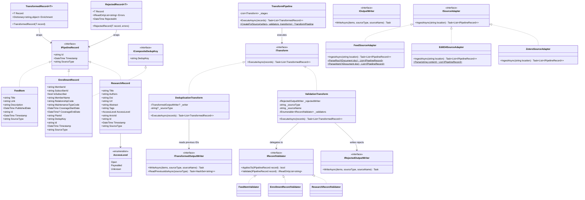

# Class Diagram: Domain Model and Core Interfaces

```mermaid
classDiagram
    class IPipelineRecord {
        <<interface>>
        +string Id
        +DateTime Timestamp
        +string SourceType
    }

    class ICompositeDedupKey {
        <<interface>>
        +string DedupKey
    }

    class FeedItem {
        +string Title
        +string Link
        +string Description
        +DateTime PublishedDate
        +string Id
        +DateTime Timestamp
        +string SourceType
    }

    class EnrollmentRecord {
        +string MemberId
        +string SubscriberId
        +bool IsSubscriber
        +string MemberName
        +string RelationshipCode
        +string MaintenanceTypeCode
        +DateTime CoverageStartDate
        +DateTime? CoverageEndDate
        +string PlanId
        +string DedupKey
        +string Id
        +DateTime Timestamp
        +string SourceType
    }

    class ResearchRecord {
        +string Title
        +string Authors
        +string Doi
        +string Url
        +string Abstract
        +string Tags
        +AccessLevel AccessLevel
        +string ArxivId
        +string Id
        +DateTime Timestamp
        +string SourceType
    }

    class AccessLevel {
        <<enumeration>>
        Open
        Paywalled
        Unknown
    }

    class TransformedRecord~T~ {
        +T Record
        +Dictionary~string,object~ Enrichment
        +TransformedRecord(T record)
    }

    class RejectedRecord~T~ {
        +T Record
        +IReadOnlyList~string~ Errors
        +DateTime RejectedAt
        +RejectedRecord(T record, errors)
    }

    class ISourceAdapter {
        <<interface>>
        +IngestAsync(string location) Task~List~IPipelineRecord~~
    }

    class ITransform {
        <<interface>>
        +ExecuteAsync(records) Task~List~TransformedRecord~~
    }

    class IRecordValidator {
        <<interface>>
        +AppliesTo(IPipelineRecord record) bool
        +Validate(IPipelineRecord record) IReadOnlyList~string~
    }

    class IOutputWriter {
        <<interface>>
        +WriteAsync(items, sourceType, sourceName) Task
    }

    class ITransformedOutputWriter {
        <<interface>>
        +WriteAsync(items, sourceType, sourceName) Task
        +ReadPreviousIdsAsync(sourceType) Task~HashSet~string~~
    }

    class IRejectedOutputWriter {
        <<interface>>
        +WriteAsync(items, sourceType, sourceName) Task
    }

    class TransformPipeline {
        -List~ITransform~ _stages
        +ExecuteAsync(records) Task~List~TransformedRecord~~
        +CreateForSource(writers, validators, transforms)$ TransformPipeline
    }

    class DeduplicationTransform {
        -ITransformedOutputWriter? _writer
        -string? _sourceType
        +ExecuteAsync(records) Task~List~TransformedRecord~~
    }

    class ValidationTransform {
        -IRejectedOutputWriter _rejectedWriter
        -string _sourceType
        -string _sourceName
        -IEnumerable~IRecordValidator~ _validators
        +ExecuteAsync(records) Task~List~TransformedRecord~~
    }

    class FeedSourceAdapter {
        +IngestAsync(string location) Task~List~IPipelineRecord~~
        +ParseRss(XDocument doc)$ List~IPipelineRecord~
        +ParseAtom(XDocument doc)$ List~IPipelineRecord~
    }

    class Edi834SourceAdapter {
        +IngestAsync(string location) Task~List~IPipelineRecord~~
        +Parse(string content)$ List~IPipelineRecord~
    }

    class ZoteroSourceAdapter {
        +IngestAsync(string location) Task~List~IPipelineRecord~~
    }

    IPipelineRecord <|.. FeedItem
    IPipelineRecord <|.. EnrollmentRecord
    IPipelineRecord <|.. ResearchRecord
    ICompositeDedupKey <|.. EnrollmentRecord
    ResearchRecord --> AccessLevel

    TransformedRecord~T~ --> IPipelineRecord : wraps
    RejectedRecord~T~ --> IPipelineRecord : wraps

    ISourceAdapter <|.. FeedSourceAdapter
    ISourceAdapter <|.. Edi834SourceAdapter
    ISourceAdapter <|.. ZoteroSourceAdapter

    ITransform <|.. DeduplicationTransform
    ITransform <|.. ValidationTransform

    IRecordValidator <|.. FeedItemValidator
    IRecordValidator <|.. EnrollmentRecordValidator
    IRecordValidator <|.. ResearchRecordValidator

    TransformPipeline --> ITransform : executes
    DeduplicationTransform --> ITransformedOutputWriter : reads previous IDs
    ValidationTransform --> IRecordValidator : delegates to
    ValidationTransform --> IRejectedOutputWriter : writes rejects
```
