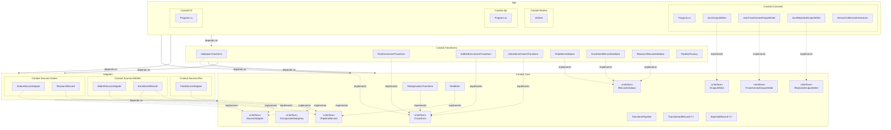

# Component Diagram: Conduit Architecture

```mermaid
graph TD
    subgraph Core["Conduit.Core"]
        direction TB
        IPipelineRecord["«interface»\nIPipelineRecord"]
        ICompositeDedupKey["«interface»\nICompositeDedupKey"]
        ISourceAdapter["«interface»\nISourceAdapter"]
        ITransform["«interface»\nITransform"]
        IOutputWriter["«interface»\nIOutputWriter"]
        ITransformedOutputWriter["«interface»\nITransformedOutputWriter"]
        IRejectedOutputWriter["«interface»\nIRejectedOutputWriter"]
        IRecordValidator["«interface»\nIRecordValidator"]
        TransformPipeline["TransformPipeline"]
        DeduplicationTransform["DeduplicationTransform"]
        TransformedRecord["TransformedRecord&lt;T&gt;"]
        RejectedRecord["RejectedRecord&lt;T&gt;"]
        FeedItem["FeedItem"]
    end

    subgraph Adapters["Adapters"]
        direction TB
        subgraph RSS["Conduit.Sources.Rss"]
            FeedSourceAdapter["FeedSourceAdapter"]
        end
        subgraph EDI["Conduit.Sources.Edi834"]
            Edi834SourceAdapter["Edi834SourceAdapter"]
            EnrollmentRecord["EnrollmentRecord"]
        end
        subgraph Zotero["Conduit.Sources.Zotero"]
            ZoteroSourceAdapter["ZoteroSourceAdapter"]
            ResearchRecord["ResearchRecord"]
        end
    end

    subgraph Transforms["Conduit.Transforms"]
        direction TB
        ValidationTransform["ValidationTransform"]
        RssEnrichmentTransform["RssEnrichmentTransform"]
        Edi834EnrichmentTransform["Edi834EnrichmentTransform"]
        ZoteroEnrichmentTransform["ZoteroEnrichmentTransform"]
        FeedItemValidator["FeedItemValidator"]
        EnrollmentRecordValidator["EnrollmentRecordValidator"]
        ResearchRecordValidator["ResearchRecordValidator"]
        PipelineFactory["PipelineFactory"]
    end

    subgraph App["App"]
        direction TB
        subgraph Console["Conduit (Console)"]
            Program["Program.cs"]
            JsonOutputWriter["JsonOutputWriter"]
            JsonTransformedOutputWriter["JsonTransformedOutputWriter"]
            JsonRejectedOutputWriter["JsonRejectedOutputWriter"]
            ServiceCollectionExtensions["ServiceCollectionExtensions"]
        end
        subgraph Worker["Conduit.Worker"]
            WorkerService["Worker"]
        end
        subgraph API["Conduit.Api"]
            ApiProgram["Program.cs"]
        end
        subgraph CLI["Conduit.Cli"]
            CliProgram["Program.cs"]
        end
    end

    Adapters -->|depends on| Core
    Transforms -->|depends on| Core
    Transforms -->|depends on| Adapters
    App -->|depends on| Core
    App -->|depends on| Adapters
    App -->|depends on| Transforms

    FeedSourceAdapter -.->|implements| ISourceAdapter
    Edi834SourceAdapter -.->|implements| ISourceAdapter
    ZoteroSourceAdapter -.->|implements| ISourceAdapter

    ValidationTransform -.->|implements| ITransform
    DeduplicationTransform -.->|implements| ITransform
    RssEnrichmentTransform -.->|implements| ITransform
    Edi834EnrichmentTransform -.->|implements| ITransform
    ZoteroEnrichmentTransform -.->|implements| ITransform

    FeedItemValidator -.->|implements| IRecordValidator
    EnrollmentRecordValidator -.->|implements| IRecordValidator
    ResearchRecordValidator -.->|implements| IRecordValidator

    JsonOutputWriter -.->|implements| IOutputWriter
    JsonTransformedOutputWriter -.->|implements| ITransformedOutputWriter
    JsonRejectedOutputWriter -.->|implements| IRejectedOutputWriter

    FeedItem -.->|implements| IPipelineRecord
    EnrollmentRecord -.->|implements| IPipelineRecord
    EnrollmentRecord -.->|implements| ICompositeDedupKey
    ResearchRecord -.->|implements| IPipelineRecord
```
