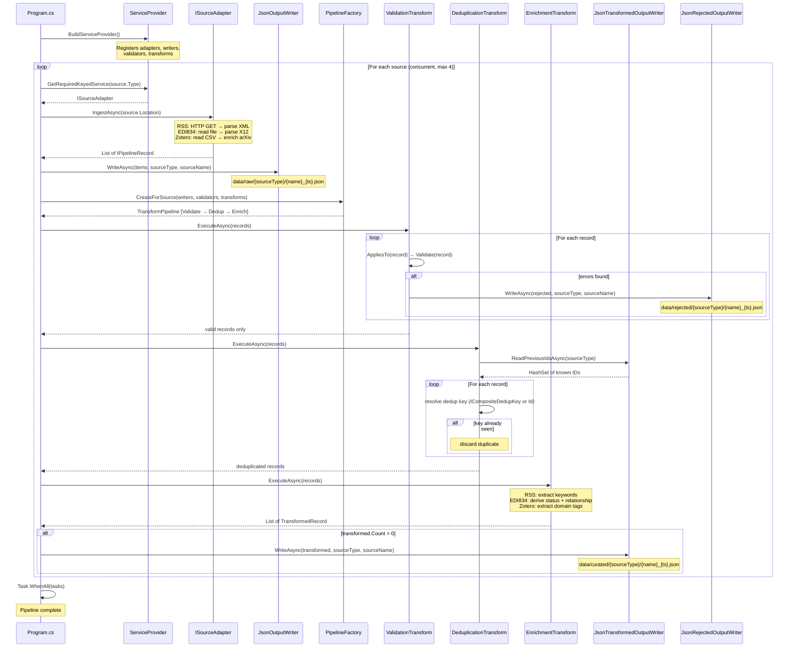

# Sequence Diagram: Single Pipeline Run

```mermaid
sequenceDiagram
    participant P as Program.cs
    participant DI as ServiceProvider
    participant A as ISourceAdapter
    participant RW as JsonOutputWriter
    participant PF as PipelineFactory
    participant VT as ValidationTransform
    participant DT as DeduplicationTransform
    participant ET as EnrichmentTransform
    participant TW as JsonTransformedOutputWriter
    participant RJW as JsonRejectedOutputWriter

    P->>DI: BuildServiceProvider()
    Note over DI: Registers adapters, writers,<br/>validators, transforms

    loop For each source (concurrent, max 4)
        P->>DI: GetRequiredKeyedService(source.Type)
        DI-->>P: ISourceAdapter

        P->>A: IngestAsync(source.Location)
        Note over A: RSS: HTTP GET → parse XML<br/>EDI834: read file → parse X12<br/>Zotero: read CSV → enrich arXiv
        A-->>P: List of IPipelineRecord

        P->>RW: WriteAsync(items, sourceType, sourceName)
        Note over RW: data/raw/{sourceType}/{name}_{ts}.json

        P->>PF: CreateForSource(writers, validators, transforms)
        PF-->>P: TransformPipeline [Validate → Dedup → Enrich]

        P->>VT: ExecuteAsync(records)
        loop For each record
            VT->>VT: AppliesTo(record) → Validate(record)
            alt errors found
                VT->>RJW: WriteAsync(rejected, sourceType, sourceName)
                Note over RJW: data/rejected/{sourceType}/{name}_{ts}.json
            end
        end
        VT-->>P: valid records only

        P->>DT: ExecuteAsync(records)
        DT->>TW: ReadPreviousIdsAsync(sourceType)
        TW-->>DT: HashSet of known IDs
        loop For each record
            DT->>DT: resolve dedup key (ICompositeDedupKey or Id)
            alt key already seen
                Note over DT: discard duplicate
            end
        end
        DT-->>P: deduplicated records

        P->>ET: ExecuteAsync(records)
        Note over ET: RSS: extract keywords<br/>EDI834: derive status + relationship<br/>Zotero: extract domain tags
        ET-->>P: List of TransformedRecord

        alt transformed.Count > 0
            P->>TW: WriteAsync(transformed, sourceType, sourceName)
            Note over TW: data/curated/{sourceType}/{name}_{ts}.json
        end
    end

    P->>P: Task.WhenAll(tasks)
    Note over P: Pipeline complete
```
